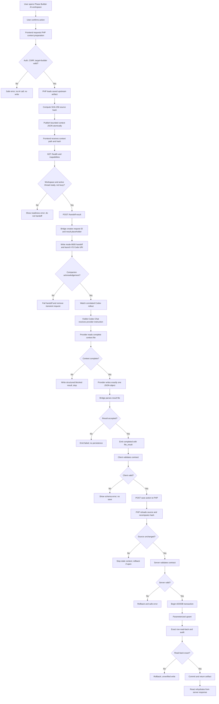

# BuilderX AI Engine

This document is the implementation checklist for the BuilderX AI engine. It
is the working contract for the Coordinator, specialist agents, six-stage
workflow, bridge communication, persistence, validation, and rollback.

Do not mark an item complete from code presence alone. Mark it complete only
after the behavior and its read-back or acceptance evidence have been verified.

## OneFlow provider operating contract

This document is also the provider-facing technical contract for BuilderX
OneFlow. It explains where an AI request starts, how context is prepared, how
the request reaches the visible Codex Chat in VS Code, where the provider must
write its result, and how BuilderX validates and persists that result.

Treat this as an execution contract, not a suggestion. If a required context
file, contract field, permission, correlation identifier, or verification step
is missing, stop safely and return a structured failure. Never guess missing
project instructions.

### OneFlow purpose

```text
Browser UI
  -> PHP context preparation
  -> saved source hash
  -> protected result-file task
  -> local BuilderX bridge
  -> VS Code companion extension
  -> visible authenticated Codex Chat
  -> AI provider
  -> one JSON result file
  -> SSE / correlated result
  -> client contract validation
  -> PHP transaction and read-back
  -> refreshed BuilderX UI
```

The provider owns analysis and result-file creation only. The provider does
not own browser state, bridge state, database transactions, audit logging, or
the final persistence decision.

### Scope and authority boundaries

The target product surfaces are:

- User Portal: `http://127.0.0.1/developer/`
- Administrator Portal: `http://127.0.0.1/developer/administrator/`
- Kotlin Android stockroom surface when the selected architecture includes it.

BuilderX Phase Builder at `/developer/phases/` is the control plane, not the
target product. Product-focused AI work must not modify:

- BuilderX Phase Builder or Phase Manager;
- `tools/builderx-bridge/`;
- BuilderX skills, contracts, installer, or platform configuration;
- unrelated files, databases, migrations, or application records.

The Execution Roadmap workflow is planning-only. Its table, field, file, and
form suggestions are advisory metadata for a later approved build stage. The
provider must not execute SQL, run migrations, create product tables, or change
product data during a roadmap request.

### Runtime components

| Component | Location | Responsibility |
|---|---|---|
| Phase Builder UI | `frontend/src/App.tsx` | Confirmation, readiness, context request, handoff, SSE, client validation, save request, and UI rehydration. |
| PHP Phase Builder route | `phases/index.php` | CSRF/authentication, context construction, source hashing, server validation, transaction, audit, and read-back. |
| Context artifacts | `storage/coordinator-context/*.json` | Complete bounded source context for one selected AI stage. |
| OneFlow bridge | `tools/builderx-bridge/server.mjs` | Handoff validation, request correlation, VS Code URI launch, acknowledgement, session observation, SSE, result parsing, and cleanup. |
| VS Code companion | `tools/builderx-bridge/extension/extension.js` | Receives URI, validates workspace, opens visible Codex Chat, sends the command, and acknowledges. |
| Result task | `.builderx/runtime/tasks/{request_id}/result.json` | Protected single authoritative JSON result file. |
| Database | Existing `bx_db()` ADODB connection | Stores only artifacts that pass validation, transaction, audit, and read-back. |

Fixed runtime values:

- workspace: `/var/www/html/developer`
- bridge: `http://127.0.0.1:43127`
- bridge version: `1.5.1`
- transport: loopback HTTP plus Server-Sent Events
- authenticated account: the ChatGPT account already active in VS Code
- OpenAI API key: not used by this bridge
- Codex CLI: not used by this bridge
- global worker or background poller: not used by this bridge

The companion may use the explicit legacy `chatgpt.implementTodo` wrapper when
direct-text delivery is unavailable. For a file-result task, the result file,
not wrapper text or chat prose, is authoritative.

### Complete OneFlow flowchart



### Detailed call sequence

#### 1. Confirm the selected workspace

The user confirms one Phase Builder workspace. The frontend must not start a
second workflow while another workflow is running. Execution Roadmap requires
the saved System Architecture artifact first.

Use the standalone Builder identity:

- `draft_key` identifies the Builder draft;
- `phase_key` belongs to the later Phase Manager boundary and must not replace
  `draft_key`;
- `request_id` identifies a bridge handoff;
- `thread_id` identifies the visible Codex session;
- `roadmap_key` or another artifact key identifies persisted Builder output.

These identifiers are not interchangeable.

#### 2. Prepare context in PHP

The frontend sends:

```text
POST /developer/phases/
action=prepare_execution_roadmap_context
target=builder
csrf=<current session CSRF token>
draft_key=<standalone Builder draft key>
```

Other stage actions are:

```text
prepare_requirements_analysis_context
prepare_system_architecture_context
prepare_ui_ux_design_context
prepare_execution_roadmap_context
```

PHP then:

1. verifies administrator authorization and CSRF;
2. validates `target=builder` and the draft key;
3. loads the saved upstream artifact;
4. rejects missing or malformed source;
5. computes SHA-256 over the exact saved source JSON;
6. loads only active and approved specialist metadata;
7. builds objective, scope, rules, source hash, source artifact, and response schema;
8. writes the context with a temporary file followed by rename.

The response includes:

```json
{
  "ok": true,
  "context_id": "execution-roadmap-<hash-prefix>",
  "source_architecture_hash": "<sha256>",
  "context_path": "/var/www/html/developer/storage/coordinator-context/execution-roadmap-<hash-prefix>.json",
  "bytes": 12345,
  "sha256": "<sha256-of-context-file>",
  "available_specialist_count": 3
}
```

The provider must treat `context_path` and the source hash as authoritative.

#### 3. Check bridge readiness immediately before handoff

```text
GET http://127.0.0.1:43127/health?workspace_root=%2Fvar%2Fwww%2Fhtml%2Fdeveloper
GET http://127.0.0.1:43127/capabilities
```

Proceed only when the relevant values are true:

```text
ok == true
workspace == /var/www/html/developer
code_ready == true
context_ready == true
companion_extension_installed == true
builderx_extension_active == true
extension_workspace_ready == true
codex_command_ready == true
extension_probe_state == ready
active_thread_ready == true
active_thread_busy == false
```

Health only authorizes a handoff attempt. It does not prove that AI ran or that
the result was saved. A busy active thread must never be interrupted or
overwritten.

#### 4. Submit the short command

The current bounded provider route is:

```http
POST http://127.0.0.1:43127/handoff-result
Content-Type: application/json
```

Payload:

```json
{
  "workspace_root": "/var/www/html/developer",
  "command": "BuilderX Phase Builder Execution Roadmap Coordinator. Read the complete context file at: /var/www/html/developer/storage/coordinator-context/execution-roadmap-<hash-prefix>.json ..."
}
```

The bridge accepts only `workspace_root` and `command`. The command is limited
to 2,000 characters. Do not put the entire architecture or response object in
the HTTP body; the complete context stays in the context file.

The response must include:

```json
{
  "ok": true,
  "delivery": {
    "request_id": "<uuid>",
    "thread_id": "<vscode-codex-session-id>",
    "state": "submitted",
    "acknowledged": true,
    "result_file": ".builderx/runtime/tasks/<uuid>/result.json"
  }
}
```

If `request_id` is absent, the request did not enter the OneFlow lifecycle.

#### 5. Understand bridge result-task creation

For `/handoff-result`, `server.mjs`:

1. creates a UUID `request_id`;
2. creates `.builderx/runtime/tasks/<request_id>/result.json`;
3. writes the exact placeholder `// BUILDERX_RESULT`;
4. applies restricted permissions;
5. writes a short-lived mode-0600 request file;
6. launches `vscode://builderx.builderx/handoff?request=<request_id>`;
7. waits for the matching companion acknowledgement;
8. records the current VS Code rollout and byte offset;
9. removes the transient request file.

The provider must not create a second result file or change the result path.

#### 6. Understand visible Codex delivery

The companion validates request ID, workspace, extension activation, and an
available Codex send command. It opens or reuses the visible authenticated
Codex Chat session and sends the generated instruction. It then acknowledges
the same `request_id` and returns a `thread_id`.

The actual AI call occurs in visible VS Code Codex Chat. The browser is only
the orchestrator. The bridge does not use browser cookies, a private ChatGPT
endpoint, an OpenAI API key, Codex CLI, or a global worker.

#### 7. Provider reads context and writes one result

The provider receives a wrapper similar to:

```text
Implement this TODO by analyzing the referenced project files.

Do not modify any project file, source code, configuration, or database.

Replace only the comment `// BUILDERX_RESULT` in:
.builderx/runtime/tasks/<request_id>/result.json

Replace it with exactly one valid JSON object required by the task. The JSON
file is the required implementation result; do not return the result object in
chat. Do not edit anything else.

BuilderX task:
BuilderX Phase Builder Execution Roadmap Coordinator.
Read the complete context file at:
/var/www/html/developer/storage/coordinator-context/<context>.json
```

Provider procedure:

1. resolve the exact workspace, context path, and result path;
2. read the complete context JSON, not a partial excerpt;
3. verify workflow, scope, source hash, rules, and required schema;
4. use the supplied upstream artifact as the source of truth;
5. perform only the named stage;
6. produce exactly one JSON object matching the required schema;
7. verify the result file still contains only `// BUILDERX_RESULT`;
8. replace only that placeholder;
9. re-read and parse the result file as one non-array JSON object;
10. stop without editing anything else or returning a second JSON copy in chat.

If the context cannot be read completely, do not infer missing content. Write
the exact blocked object required by the context, for example:

```json
{"status":"error","error":"ROADMAP_CONTEXT_UNAVAILABLE"}
```

BuilderX will reject a blocked object when the selected stage requires the full
contract and will stop before persistence. This is intentional.

#### 8. Consume correlated progress

The frontend opens one stream:

```text
GET http://127.0.0.1:43127/events?request_id=<uuid>
Accept: text/event-stream
```

Normal event sequence:

```text
ready
thread
status
assistant_message       optional safe progress text
completed               terminal success
```

Failure terminal event:

```text
failed
```

Private reasoning and raw tool arguments are not forwarded. The stream is
correlated by `request_id`; a visible assistant message, HTTP 200, `ready`, or
`status` event is not completion.

#### 9. Bridge validates the result file

The bridge rejects an empty file, unchanged placeholder, invalid JSON, array,
scalar, or unreadable result. It returns the parsed object as `file_result`.
The temporary result directory is disposed after terminal handling, so the
frontend must capture `file_result` before cleanup.

#### 10. Client and server validate independently

The frontend validates the returned object before sending a save request. PHP
repeats the validation as the authoritative boundary. Both checks cover:

- schema version and contract type;
- source identity and upstream hash;
- object/array shapes and required fields;
- phase, task, and sub-task IDs and uniqueness;
- allowed tracks and icon-only indicators;
- lower-snake-case table and field suggestions;
- allowed form actions;
- detailed sub-task descriptions, acceptance criteria, dependencies, and Pending todos.

Client validation is a usability gate. Server validation is the security and
persistence gate. Execution Roadmap is split into four stage contracts so a
single specialist is not asked to design the entire system in one response:

1. `builderx.execution-roadmap.stage.phases.v1` produces connected standalone
   phases and page/system flow steps.
2. `builderx.execution-roadmap.stage.tasks.v1` preserves phase IDs and adds
   small implementation tasks.
3. `builderx.execution-roadmap.stage.subtasks.v1` preserves phases and tasks,
   then adds detailed sub-tasks, acceptance criteria, dependencies, and todos.
4. `builderx.execution-roadmap.v3` preserves all upstream IDs and adds
   proposed forms, fields, APIs, tables, background processes, reports,
   analytics, states, permissions, and resource references.

Each successful stage is saved in `stages_json` before the next bridge call.
The fifth UI action runs the four calls sequentially; a failed later stage
does not discard earlier verified output.

#### 11. PHP transaction and read-back

The frontend submits:

```text
POST /developer/phases/
action=save_phase_builder_execution_roadmap
target=builder
csrf=<current session CSRF token>
draft_key=<standalone Builder draft key>
context_architecture_hash=<hash captured during preparation>
roadmap_json=<validated JSON object>
```

PHP then:

1. authenticates and authorizes;
2. verifies CSRF, target, draft, JSON size, and shape;
3. reloads the saved System Architecture;
4. recomputes SHA-256 and rejects stale context;
5. validates the complete artifact again;
6. begins an ADODB transaction from `bx_db()`;
7. locks and reads the existing roadmap row;
8. preserves only progress keys that still exist;
9. upserts `roadmap_json` and `progress_json` with parameterized SQL;
10. reads the saved row back;
11. compares stable key, draft key, source hash, JSON, and progress JSON exactly;
12. writes audit data;
13. commits only after every comparison succeeds;
14. rolls back on every failure.

No new Phase Manager table is required for this Builder artifact. Phase Manager
materialization is a later, separate change.

#### 12. React rehydrates from server data

After a successful response, React replaces its in-memory artifact and progress
map with the returned server values, updates the workflow report, and renders
the saved state. Refresh the page when verifying persistence. A success message
without server read-back is not completion.

### Provider master prompt

Use this as the conceptual system prompt for the AI provider. The concrete
stage command and context path are appended at runtime:

```text
You are the BuilderX OneFlow AI Agent Provider.

Your request is bounded by one BuilderX context file and one protected JSON result file.

OPERATING MODE
1. Read the complete context file before analysis.
2. Treat its workflow, scope, rules, source hash, and required_response as authoritative.
3. Work only on the named BuilderX stage.
4. Treat BuilderX Phase Builder, Phase Manager, bridge, skills, installer, and platform files as excluded from product implementation unless this is explicitly a BuilderX maintenance task.
5. Do not call another agent, bridge, worker, poller, Codex CLI, or external AI service.
6. Do not edit source, configuration, migrations, tables, product records, or any file other than the supplied result placeholder.
7. Do not claim parallel execution without independent channels and fan-in evidence.

PROCEDURE
1. Read the complete context path.
2. If it is missing, unreadable, incomplete, or contradictory, do not guess; write the context-specific blocked JSON object and stop.
3. Verify scope and upstream source hash.
4. Read every rule and every required response field.
5. Analyze only supplied source artifacts and permitted documentation.
6. Preserve identifiers, URLs, requirements, architecture boundaries, and technical meaning.
7. Produce exactly one JSON object matching required_response.
8. Open the result file and confirm it contains only // BUILDERX_RESULT.
9. Replace only that placeholder with the JSON object.
10. Re-read and parse the result file as one JSON object.
11. Do not return the JSON object in chat; chat prose is not authoritative.
12. Do not make any other edit. Stop after result verification.

OUTPUT RULES
- one JSON object only;
- no Markdown fences;
- no prose before or after the object in the result file;
- no invented fields or missing required fields;
- no unsafe writes.

FAILURE RULE
If the context cannot be read completely, stop with the exact blocked object required by the context. Do not fabricate a result.
```

### Stage-specific provider rules

#### Narrative & Cleanup

- Preserve meaning, requirements, URLs, identifiers, technical details, and ordering.
- Correct spelling, grammar, punctuation, capitalization, and readability only.
- Do not redesign requirements or invent architecture.

#### Requirements Analysis

- Analyze the complete saved narrative.
- Keep functional requirements distinct from assumptions, risks, and open questions.
- Include every production-readiness category required by the context.
- Do not design tables, APIs, migrations, or implementation tasks unless requested as advisory output.

#### System Architecture

- Use the saved requirements contract as the source of truth.
- Define boundaries, actors, routes, screens, forms, entities, integrations, security, synchronization, and file manifest as requested.
- Keep BuilderX platform files outside the product architecture.
- Use schema-safe lower-snake-case identifiers for proposed persistent entities.

#### UI/UX Design

- Produce screens, purposes, low-fidelity layout, flow-chart steps, responsive rules, accessibility rules, and relevant loading/empty/error/success/offline/recovery states.
- Use existing React/shadcn/ui patterns.
- Do not modify the application while producing the contract.

#### Execution Roadmap

- Run the four stage contracts in order; the fifth action is only an
  orchestrator and must not skip a failed stage.
- Return `builderx.execution-roadmap.v3` from the resource stage.
- Use `phase -> tasks -> subTasks -> todos` and keep every initial phase status
  `Pending`.
- Make phases page/system-flow oriented and tasks small enough to execute
  independently; do not hide several screens or CRUD operations in one task.
- Use icon-only indicator slugs; labels belong in UI tooltips, not stored
  display text.
- Keep proposed table and field names lower_snake_case.
- Treat forms, fields, tables, APIs, background processes, reports, analytics,
  and related files as advisory proposals for later coding specialists.
- Preserve upstream IDs and wording when enhancing a previous stage.
- Do not export or materialize Phase Manager records during this provider turn.

### How to add a new AI call safely

When adding another BuilderX AI stage, do not create a one-off fetch path. Copy
the existing OneFlow shape and change only the stage-specific contract.

#### A. Add the PHP context-preparation action

In `phases/index.php`:

1. Add `prepare_<stage>_context` inside the authenticated `target=builder`
   request branch.
2. Read the exact saved upstream artifact from its existing Phase Builder table
   using a parameterized query and the standalone `draft_key`.
3. Reject missing, malformed, unauthorized, or stale upstream data.
4. Compute a SHA-256 hash over the exact source JSON.
5. Load only active and approved specialists from `AiSpecialistRegistry`.
6. Build a context object containing `context_id`, `draft_key`, `workflow`,
   `project_scope`, `objective`, `source_<stage>_hash`, `approved_specialists`,
   source artifact, rules, and `required_response`.
7. Write it through `$writePhaseCoordinatorContext($contextId, $context)`.
8. Return `context_path`, source hash, context hash, and specialist count.

Do not put the complete source artifact in the bridge command. Keep the command
short and keep the complete input in the protected context file.

#### B. Add the frontend preparation, validation, save, and runner functions

In `frontend/src/App.tsx`, add the following four responsibilities:

```text
prepare<Stage>Context()
validate<Stage>Result(value)
save<Stage>(result, sourceHash)
run<Stage>()
```

The runner must follow this order:

```text
if missing draft/upstream/running -> return
open confirmation/result dialog
set workflow = running/context
prepare<Stage>Context()
set workflow = running/analysis
build a short provider command with context_path
sendVsCodeBridgeTask(command, label, progressCallback, { resultFile: true })
parse result.fileResult
validate<Stage>Result(result)
set workflow = running/save
save<Stage>(validatedResult, sourceHash)
replace React state with saved server payload
set workflow = success/complete only after read-back response
catch -> set workflow = error and stop before claiming persistence
```

Use the shared `sendVsCodeBridgeTask` helper. It already performs health
preflight, `/handoff-result`, acknowledgement correlation, SSE consumption,
file-result fallback, and terminal failure handling.

Use this command shape:

```ts
const command = [
  'BuilderX Phase Builder <Stage> Coordinator.',
  'Read the complete context file at:',
  context.context_path,
  'Use the saved upstream artifact as the source of truth.',
  'Act only at the permitted product scope; BuilderX platform files are excluded.',
  'Write exactly one valid JSON object to the result file supplied by the bridge.',
  'Do not edit source files, execute SQL, change databases, or call another agent.',
  'Stop with the context-specific unavailable error if the context cannot be read completely.',
].join('\\n')
```

Do not send a full prompt larger than the bridge's 2,000-character command
limit. The context file carries the detailed schema and source.

#### C. Add the confirmation and progress UI

Add a confirmation state and a result dialog for the new stage. The dialog must
show these logical steps:

1. Read the saved upstream source.
2. Coordinator/provider analysis in visible Codex Chat.
3. Contract validation, transaction, and read-back.

Show the provider report only as diagnostic progress. Show success only after
the save response includes the persisted artifact. Show the exact failure in an
alert state and explain whether the failure happened before handoff, during the
provider call, during validation, or during persistence.

#### D. Add server validation and persistence

The save action must repeat every client validation on the server. It must:

1. verify authentication, authorization, CSRF, target, draft key, and source hash;
2. decode and validate the complete contract;
3. begin `bx_db()`/ADODB `BeginTrans()`;
4. lock the existing artifact row by its standalone business key;
5. upsert with parameterized SQL and fixed table/column identifiers;
6. read the exact row back;
7. compare every persisted field and stable key;
8. append audit data in the same transaction;
9. commit only after all comparisons pass;
10. roll back on every exception or mismatch;
11. return the saved artifact and progress map for React rehydration.

#### E. Add correlation and failure evidence

Every new AI call must record or expose:

```text
draft_key
context_id
source hash
request_id
thread_id
artifact key
workflow status
terminal event
persistence status
read-back result
```

Do not add a new global poller, direct OpenAI API call, hidden background
worker, or uncorrelated chat listener. If the new stage needs a capability the
bridge does not provide, document it as a blocker instead of silently creating
another transport.

### Correlation identifiers

| Identifier | Purpose |
|---|---|
| `draft_key` | Standalone Builder draft scope. |
| `context_id` | Prepared bounded context identity. |
| `architectureHash` | Detects source changes between prepare and save. |
| `request_id` | Correlates handoff, result file, SSE stream, and terminal result. |
| `thread_id` | Identifies the visible VS Code Codex session. |
| `roadmap_key` | Stable saved Builder artifact key. |
| progress key | Task or sub-task completion identity. |

### Failure and recovery matrix

| Failure | Detection | Safe response |
|---|---|---|
| Context missing/incomplete | PHP cannot load or encode source | Stop before handoff; return context-unavailable error. |
| Bridge not ready | Health readiness condition false | Do not submit; repair VS Code/extension/bridge first. |
| Active thread busy | `active_thread_busy=true` | Do not interrupt; retry after completion. |
| Handoff rejected | Non-2xx or missing `request_id` | Stop before provider execution. |
| Acknowledgement timeout | No matching acknowledgement | Reload VS Code and recheck health. |
| Stream failure | `failed` or early stream end | Use correlated `/result` once; otherwise retry safely. |
| Placeholder remains | Bridge sees `// BUILDERX_RESULT` | Reject; provider must complete the result file. |
| Invalid/schema result | Bridge/client/server validator fails | No database write; correct provider output. |
| Source changed | PHP hash mismatch | Prepare fresh context and rerun. |
| Upsert/read-back failure | ADODB error or field mismatch | Roll back; never claim success. |

Never retry a write blindly. First determine whether the provider ran, whether
the result file was accepted, and whether the database transaction committed.

### Bridge endpoint reference

- `GET /health?workspace_root=...` — readiness and active-session state.
- `GET /capabilities` — bridge version, transport, events, delivery mode, and parallelism capability.
- `POST /handoff` — ordinary visible-chat handoff; chat text is the result channel.
- `POST /handoff-result` — preferred bounded-provider handoff with protected result file.
- `GET /events?request_id=...` — one correlated SSE stream.
- `GET /result?request_id=...` — bounded fallback completion read.
- `POST /restart` — resets transient bridge state and opens VS Code reload; may interrupt an active turn and requires confirmation.

### Provider integration definition of done

OneFlow is complete only when:

1. the user confirmed the action;
2. PHP prepared and hashed complete source context;
3. bridge readiness passed immediately before handoff;
4. visible authenticated Codex Chat received the request;
5. provider wrote and verified one JSON result file;
6. bridge emitted correlated terminal completion;
7. client and server validation passed;
8. source hash remained current;
9. ADODB transaction committed after exact read-back and audit;
10. React rendered the server-returned artifact;
11. refresh or restart preserved the same state.

If any item is missing, the correct state is incomplete or blocked.

## Scope boundary

The Coordinator operates on the target product only:

- User Portal: `http://127.0.0.1/developer/`
- Administrator Portal: `http://127.0.0.1/developer/administrator/`

BuilderX Phase Builder at `/developer/phases/` is the high-level control plane
used to plan and build products. It is not part of the target product. The
Coordinator and specialists must never modify the Phase Builder, BuilderX
bridge, BuilderX skills, installer, or other development-platform files while
working on a product task. Platform defects must be reported as blockers for a
separate BuilderX maintenance task.

## Current foundation

- [x] Rollback snapshot preserved.
- [x] BuilderX VS Code bridge installed.
- [x] Bridge `Hi` round trip tested.
- [x] Task and specialist registry foundations documented and available.
- [x] Database test table created without destructive SQL.
- [x] Bridge health and correlated result endpoints available.

## Phase 1 — Coordinator proof of concept

- [ ] Add a `Test Coordinator` button.
- [ ] Require confirmation before sending.
- [ ] Define three read-only specialists: Requirements, Database, and UI/UX.
- [ ] Send one bounded Coordinator request.
- [ ] Let the Coordinator choose the required specialists.
- [ ] Return the reason for each selection.
- [ ] Return structured specialist results.
- [ ] Show a reconciled summary in the UI.
- [ ] Clearly label this as a simulated parallel plan.

Acceptance: one request produces a Coordinator decision and specialist report
without changing files or application database data.

## Phase 2 — Persist orchestration

- [ ] Create a parent Coordinator task.
- [ ] Create child task records for selected specialists.
- [ ] Add correlation IDs.
- [ ] Store status, result, errors, timestamps, and risks.
- [ ] Use transactions and parameterized SQL.
- [ ] Read back every saved task.
- [ ] Restore task state after page refresh or restart.

Acceptance: the complete Coordinator run can be inspected after reload.

## Phase 3 — Real parallel specialist execution

- [ ] Dispatch each specialist as an independent task.
- [ ] Use separate task IDs and result channels.
- [ ] Allow only independent tasks to run concurrently.
- [ ] Wait for all selected specialists.
- [ ] Reconcile results with fan-in.
- [ ] Detect conflicting results.
- [ ] Handle partial failure, timeout, cancellation, and retry.

Acceptance: two or more specialists genuinely execute independently and their
results are reconciled. Until this phase passes, the system must not claim
that it is performing true parallel execution.

## Phase 4 — Six-stage workflow

- [ ] Implement `Think` for requirements and architecture.
- [ ] Implement `Design` for UI/UX, database, and solution design.
- [ ] Implement `Build` for frontend and backend work.
- [ ] Implement `Validate` for testing, security, and accessibility.
- [ ] Implement `Document` for documentation and handoff.
- [ ] Implement `Preserve` for persistence, maintenance, and rollback.
- [ ] Enforce valid stage transitions.
- [ ] Block unauthorized stage skipping.

Acceptance: a task moves through the stages in order and stops when
validation or approval fails.

## Phase 5 — Permissions and mutation control

- [ ] Keep specialists read-only by default.
- [ ] Allow file and database changes only through approved Build paths.
- [ ] Require Phase Manager approval for sensitive operations.
- [ ] Prevent specialists from granting themselves permissions.
- [ ] Add authorization, CSRF, validation, and audit checks.
- [ ] Prevent duplicate or replayed tasks.

Acceptance: read-only specialists cannot modify files or database records.

## Phase 6 — Bridge reliability

- [ ] Verify health before every handoff.
- [ ] Reject requests while the target thread is busy.
- [ ] Correlate each request with the correct result.
- [ ] Handle bridge restart and reconnect.
- [ ] Preserve queued task state.
- [ ] Show actionable failure messages.
- [ ] Verify the visible BuilderX bridge result, not only HTTP success.

Acceptance: the workflow recovers safely from bridge or VS Code restart without
losing task state.

## Phase 7 — Validation

- [ ] Test Coordinator selection.
- [ ] Test specialist routing.
- [ ] Test true parallel dispatch.
- [ ] Test conflict reconciliation.
- [ ] Test failed and cancelled tasks.
- [ ] Test unauthorized write rejection.
- [ ] Test database transaction rollback.
- [ ] Test refresh and restart persistence.
- [ ] Test accessibility and responsive UI.
- [ ] Test token and context limits.

## Phase 8 — Documentation and preservation

- [ ] Keep `install.md` aligned with the actual implementation.
- [ ] Record the actual bridge version and installation commands.
- [ ] Document Coordinator and specialist contracts.
- [ ] Document task states and recovery procedures.
- [ ] Document permissions and approval boundaries.
- [ ] Document testing commands and evidence.
- [ ] Keep the rollback snapshot until final acceptance.
- [ ] Obtain explicit approval before deleting old AI data or rollback files.

## Final definition of done

- [ ] User submits one goal.
- [ ] Coordinator selects appropriate specialists.
- [ ] Independent specialists execute in parallel.
- [ ] Results are reconciled.
- [ ] Approval is enforced before mutations.
- [ ] The six stages are enforced.
- [ ] Results persist after refresh and restart.
- [ ] Bridge failures recover safely.
- [ ] Documentation matches the actual implementation.
- [ ] Rollback remains available until the user approves removal.

## Safety rules

- Do not use Codex CLI, `codex exec`, legacy workers, automatic pollers, or
  unrelated bridges for this engine.
- Use the installed BuilderX VS Code bridge for visible Codex Chat delivery.
- Do not drop, delete, truncate, or rename user tables unless the user gives
  separate explicit approval.
- Do not claim that a task is complete from a health response alone; verify the
  correlated result and persisted read-back.
- Do not claim true parallel execution until independent specialist dispatch
  and fan-in reconciliation have been demonstrated.
