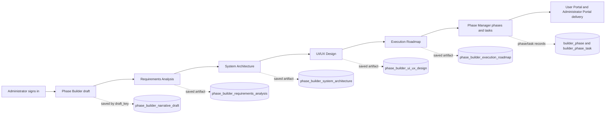

# BuilderX Phases Documentation

## Document status

This document describes the Phase Builder and Phase Manager implementation in the current `/var/www/html/developer` workspace as reviewed on 2026-08-16.

The runtime source is authoritative:

- `phases/index.php` — PHP route, request actions, authorization, persistence, and read-back.
- `frontend/src/App.tsx` — React screens, tabs, forms, dialogs, workflow state, and rendering.
- `app/foundation.php` — database connection, schema helpers, authentication, CSRF, audit logging, and Builder draft schema.
- `docs/project/rules.md` — current project boundaries and UI/database rules.

`AI-ENGINE.md` and `install.md` contain planning or historical material that can be broader than the current rules. They must not be treated as proof that an AI bridge, Codex transport, poller, or worker is currently enabled.

## 1. Purpose and scope

BuilderX has two related but separate administration tools:

| Tool | Purpose | Product scope |
|---|---|---|
| Phase Builder | Prepare a product draft and progressively produce requirements, architecture, UI/UX, and a roadmap. | BuilderX control plane; it is not part of the target product. |
| Phase Manager | Manage implementation phases and tasks for the target product. | Project planning and execution administration for the User Portal and Administrator Portal. |

The target product is limited to:

- User Portal: `/developer/`
- Administrator Portal: `/developer/administrator/`

The Phase Builder route is `/developer/phases/`. It is an administrative control plane and should not be included in product implementation tasks merely because it is the tool used to prepare them.

## 2. Routes and navigation

### Phase Builder

```text
/developer/phases/?target=builder
```

The administrator sidebar exposes **Phase Builder** and **Phase Manager** as separate destinations. The Phase Builder uses a shared BuilderX shell with a main workspace and a right-side workspace-action panel.

### Phase Manager

```text
/developer/phases/
/developer/phases/?target=manager
```

The manager uses the same route with the default target. A selected manager phase is addressed with:

```text
/developer/phases/?phase=<phase_key>
```

`phase_key` is a valid identity for Phase Manager phases and tasks. It is not the active identity for a standalone Phase Builder draft.

### Shared navigation state

- `target=builder` selects Phase Builder.
- Any other target value selects Phase Manager.
- `phase=<phase_key>` selects a Phase Manager phase.
- `phase_view` selects manager views such as roadmap or custom/tasks where applicable.
- Builder draft identity is supplied from the server as `phaseBuilderDraftKey`; it is not derived from the selected manager phase.

## 3. Authentication and request protection

Both tools use the shared BuilderX administrator authentication boundary.

1. The request loads the shared session and current user.
2. `bx_is_admin()` determines whether the user may use Phase Builder or Phase Manager actions.
3. Unauthenticated users receive the shared login experience.
4. POST actions require the CSRF token verified by `bx_verify_csrf()`.
5. Database actions use the shared ADODB connection from `bx_db()`.
6. Successful writes are audited through `bx_audit()` and read back before success is reported where the action contract requires verification.

The Phase Builder and Phase Manager therefore share credentials, but they do not share the same data identity model.

## 4. End-to-end phase lifecycle



Each later Builder tab is based on a verified saved artifact from the previous stage. A missing or stale prerequisite should stop the workflow instead of allowing an unverified write.

## 5. Phase Builder workspaces

The current Phase Builder tab menu is:

1. Narrative & Cleanup
2. Requirements Analysis
3. System Architecture
4. UI/UX Design
5. Execution Roadmap

The first tab is the source draft. The remaining tabs are derived planning artifacts. They are not the same thing as Phase Manager phases.

### 5.1 Narrative & Cleanup

This is the primary product narrative. It contains nine saved sections:

| Field | Meaning |
|---|---|
| `product_goal` | Product objective and intended outcome. |
| `users_and_roles` | User groups, roles, and access expectations. |
| `main_user_journey` | Primary user journeys and operational sequence. |
| `web_requirements` | User Portal and Administrator Portal requirements. |
| `android_requirements` | Kotlin Android stockroom requirements. |
| `database_and_synchronization` | MySQL, Firestore, synchronization, and data-authority requirements. |
| `security_and_permissions` | Authentication, authorization, privacy, secrets, and access boundaries. |
| `validation_and_error_handling` | Validation, failure, retry, recovery, and concurrency behavior. |
| `open_questions` | Unresolved decisions and information still required. |

The active Builder identity is `draft_key`. The server loads the current draft with `bx_phase_builder_current_draft_key()` and reads the nine fields from `phase_builder_narrative_draft`.

The narrative backup table is `phase_builder_narrative_draft_backup`. It is created from the narrative table shape and is intended to preserve a copy before a narrative replacement. The current rules prohibit destructive replacement without a recoverable backup and read-back.

The narrative save path should:

1. Validate the administrator and CSRF token.
2. Validate all nine fields.
3. Use the current `draft_key`.
4. Write with parameterized ADODB SQL inside a transaction.
5. Preserve the backup boundary when replacing an existing narrative.
6. Read back the saved row.
7. Rehydrate the UI from the server result.

### 5.2 Requirements Analysis

Requirements Analysis converts the approved narrative into traceable requirements. It should not design the architecture or implement code.

The current contract includes:

- `schemaVersion`: `builderx.requirements-analysis.v2`
- `contractType`: `builderx.requirements-analysis`
- source narrative hash and source sections
- project analysis, actors, entities, and portals
- functional requirements
- production-readiness categories
- assumptions, risks, open questions, review checklist, and traceability
- orchestration metadata

The current production categories are:

1. Non-functional Requirements
2. Architecture & Technical Constraints
3. Security & Privacy
4. Installation & Deployment
5. Configuration & Environment
6. Data Migration & Backup
7. Performance & Scalability
8. Availability & Recovery
9. Monitoring & Audit
10. Accessibility & Compatibility
11. Testing & Quality
12. Maintenance & Support
13. Release & Rollback

The saved artifact is associated with `draft_key` and records `source_narrative_hash`. This prevents a requirements result generated from an older narrative from being silently treated as current.

### 5.3 System Architecture

System Architecture turns the saved Requirements Analysis into an implementation-oriented design contract for the target product. The target surfaces are the User Portal, Administrator Portal, and, where the saved requirements include it, the Kotlin Android stockroom surface. BuilderX Phase Builder remains excluded.

The architecture contract can include:

- architecture overview and boundaries
- technology and integration decisions
- security and data-authority boundaries
- proposed forms
- proposed database tables and fields
- migration artifact
- PHP backend artifact
- React frontend artifact
- Kotlin/mobile artifact where required
- assumptions, risks, and orchestration data

The server verifies that a saved Requirements Analysis exists and passes its source hash into the architecture save. The artifact is stored in `phase_builder_system_architecture` under the same `draft_key`.

### 5.4 UI/UX Design

UI/UX Design converts the saved architecture into a product-surface design proposal. It is not a request to modify the Phase Builder itself.

The UI/UX contract requires, at minimum:

- a design blueprint
- one or more product screens
- a non-empty `flowChart`
- responsive rules
- accessibility rules
- loading, empty, error, success, offline, and recovery states where relevant
- orchestration metadata

The current front end validates that each screen has a name and purpose and that each flow entry has `from`, `to`, and `label`. The saved artifact is stored in `phase_builder_ui_ux_design` and is tied to the architecture source hash.

### 5.5 Execution Roadmap

Execution Roadmap turns the saved System Architecture into a small, implementation-ready hierarchy for the Phase Builder code-building stage. Phase Manager remains a separate surface and is intentionally not changed by this refactor.

The current validation requires:

- final schema version `builderx.execution-roadmap.v3` (v1/v2 remain readable)
- contract type `builderx.execution-roadmap`
- a valid source and `phaseExecutionOverview`
- between 5 and 9 phases
- every phase to have a unique identity, title, description, and `Pending` status
- every phase to contain focused tasks with unique IDs, titles, descriptions, and a `web`, `android`, or `shared` track
- every task to contain detailed sub-tasks with unique IDs, descriptions, acceptance criteria, dependencies, and Pending todos
- every task indicator to use an allowlisted icon slug; common aliases are normalized at the client and server boundary, while the UI renders the canonical icon and exposes its label through a tooltip
- advisory implementation suggestions to use lower-snake-case table and field names, related files, and explicit form actions such as `add`, `edit`, `search`, `delete`, `view`, or `bulk_update`

The roadmap is saved in the existing `phase_builder_execution_roadmap.roadmap_json` artifact with `progress_json` for task/sub-task/todo completion and `stages_json` for the module blueprint plus the four verified specialist passes; no Phase Manager table is changed. The staged workflow is:

1. module blueprint: compact module boundaries, UI/UX scope, dependencies, and `provides`/`consumes` interface summaries
2. phase analysis: connected standalone phases grouped by `moduleId` and page/system flow
3. task decomposition: small Web, Android, Shared, API, database, background, security, reporting, and analytics tasks
4. execution decomposition: detailed sub-tasks, acceptance criteria, dependencies, and todos
5. resource mapping: a compact set of proposed forms, fields, routes, APIs, tables, indexes, background processes, reports, analytics, states, and permissions keyed by phase

The module blueprint uses `builderx.execution-roadmap.stage.modules.v1` and is stored as `stages_json.modules`. A later module does not reread the full project by default. Its focused context contains the global rules, its own module boundary, and the compact interface summaries of the modules listed in its `dependsOn`. For example, Module 9 can consume Module 1's approved API or data contracts without receiving every screen, task, and resource from Modules 2 through 8. The full architecture and UI/UX sources are read once to establish the catalog; downstream work uses verified checkpoints and bounded module contexts.

The fourth specialist processes resources phase-by-phase. For each saved phase, the Phase Builder creates a focused context, sends one resource request, validates the single `phaseId` patch, and saves a transactionally verified checkpoint before continuing. If the loop is interrupted, a later run resumes from the saved phase patches. After every phase is covered, a background assembly step merges those resource patches into the saved Stage 3 `phase -> tasks[] -> subTasks[] -> todos[]` checkpoint. The assembled result is then validated and saved as `builderx.execution-roadmap.v3`. This prevents the resource specialist from carrying the entire upstream hierarchy in one AI response and protects previously verified tasks from being dropped.

The full-run action first saves or refreshes the module blueprint, then runs the four roadmap passes sequentially. A verified checkpoint is skipped during a later full-run resume; use an individual stage action to deliberately refine a saved result, or clear staged results to rebuild from the beginning. The final contract is `builderx.execution-roadmap.v3` with `phase -> tasks[] -> subTasks[] -> todos[]`. Proposed forms and tables are planning metadata only; they are not product database writes. Existing v1/v2 saved roadmaps remain readable for compatibility.

Legacy v1 roadmap rows retain a compatibility display and export path. v2 export/materialization into `builder_phase` and `builder_phase_task` is intentionally deferred until the later Phase Manager refactor.

## 6. Phase Manager

Phase Manager is the project-level planning and task administration surface. Its current views are:

- Overview
- Tasks
- Create phase

### Phase records

Phase records are stored in `builder_phase` and include:

- `phase_key` — stable Phase Manager identity
- `phase_number`
- `phase_code` such as `P1`
- `phase_title`
- `phase_summary`
- `phase_status`
- `phase_sort_order`

Supported phase statuses in the current route are:

- `Not Started`
- `In Progress`
- `For Review`
- `Completed`
- `Blocked`

### Task records

Tasks are stored in `builder_phase_task` and include:

- `task_key`
- `phase_key`
- `task_code`
- `task_title`
- `task_details`
- `task_reference` where supplied
- `is_completed`
- `task_status`
- `task_sort_order`

The selected Phase Manager phase filters the task list. Deletion is soft-state behavior: phase or task status is changed to `DELETED`; rows are not physically removed by the normal route.

### Phase Manager operations

The route supports the following families of operations:

- create a phase
- update a phase
- soft-delete a phase and its active tasks
- create a task
- update a task
- mark a task complete/open
- soft-delete a task
- read selected phase and task data
- optionally materialize selected roadmap work through the roadmap export action

Create and task operations use a transaction and explicit read-back verification. The route also records audit entries for creates, updates, exports, and deletes.

## 7. Database model

### 7.1 Builder draft and artifact tables

| Table | Identity | Source/dependency | Stored content |
|---|---|---|---|
| `phase_builder_narrative_draft` | `draft_key` | Standalone Builder draft | Nine narrative fields. |
| `phase_builder_narrative_draft_backup` | `draft_key` | Backup of narrative shape | Recoverable narrative copy. |
| `phase_builder_requirements_analysis` | `analysis_key`, `draft_key` | Narrative hash | Requirements contract JSON. |
| `phase_builder_system_architecture` | `architecture_key`, `draft_key` | Requirements hash | Architecture contract JSON. |
| `phase_builder_ui_ux_design` | `ui_ux_key`, `draft_key` | Architecture hash | UI/UX design and flow JSON. |
| `phase_builder_execution_roadmap` | `roadmap_key`, `draft_key` | Architecture hash | Roadmap JSON and progress JSON. |

The artifact tables retain a nullable legacy `phase_key` column for compatibility with older rows and migrations. Current Builder loading and saving use `draft_key`. A `phase_key` found in a legacy Builder artifact must not be treated as the active Builder identity.

### 7.2 Phase Manager tables

| Table | Identity | Relationship |
|---|---|---|
| `builder_phase` | `phase_key` | One record per managed phase. |
| `builder_phase_task` | `task_key` | Many tasks belong to one `phase_key`. |

These tables intentionally use `phase_key` because Phase Manager phases and their tasks are a separate domain from the standalone Builder draft.

### 7.3 Shared foundation tables

`app/foundation.php` also defines the shared administration and audit foundation, including:

- `builder_system_setting`
- `builder_user`
- `builder_group`
- `builder_role`
- `builder_permission`
- user/group/role/permission link tables
- `builder_user_session`
- password reset, password history, and login history tables
- `builder_audit_log`

The same foundation file contains older AI-oriented tables such as `builder_ai_task`, `builder_ai_specialist`, `builder_ai_approval`, and `builder_ai_memory`. Their presence in the schema is not proof that an AI transport or orchestration runtime is enabled.

## 8. Persistence and safety contract

All new or changed persisted behavior must follow the project database rules:

1. Use the existing `bx_db()` ADODB connection.
2. Use parameterized SQL for values.
3. Validate identifiers against a fixed allowlist; never interpolate user-controlled table or column names.
4. Start a transaction for a multi-step write.
5. Lock or re-read the relevant record when concurrency matters.
6. Write the record or upsert.
7. Read the exact saved row back.
8. Compare the read-back values with the submitted or calculated values.
9. Commit only after verification succeeds.
10. Roll back on exceptions or verification failure.
11. Record an audit event after the verified operation.
12. Return or render the verified server state so the UI is rehydrated from the database.

Do not use `DROP`, `TRUNCATE`, or broad deletes for ordinary phase or Builder artifact updates. The Phase Manager delete route uses soft-delete status and verifies the resulting state.

## 9. Current BuilderX OneFlow and AI boundary

The project rules currently prohibit relying on:

- Codex CLI
- a VS Code Codex bridge
- Desktop Codex handoff
- `codex://` links
- workers, sockets, queues, pollers, or background retry loops
- hidden AI dispatch or automatic status loops

The source still contains preparation, workflow, and legacy AI-related code paths. Those paths should be treated as compatibility or historical implementation surface unless the current project rules are explicitly changed. The safe current interpretation is:

- Phase Builder is a data-backed planning tool.
- Saved artifacts must be valid, bounded JSON and must pass server validation.
- AI transport is not an assumed dependency for the Phase Builder to be usable.
- A UI indicator must not claim that an AI bridge is ready unless a supported, explicitly authorized transport is actually verified.
- `AI-ENGINE.md` is a design/checklist reference, not a runtime guarantee.

## 10. Recommended operating procedure

### Prepare a project plan

1. Sign in through the shared administrator login.
2. Open **Phase Builder**.
3. Complete the nine Narrative & Cleanup sections.
4. Save and verify the narrative read-back.
5. Review Requirements Analysis and confirm its source narrative is current.
6. Review System Architecture and confirm its source requirements hash is current.
7. Review UI/UX Design and its flow chart, screens, responsive rules, and accessibility states.
8. Review Execution Roadmap and its Web/Mobile task separation.
9. Decide whether the current product requires roadmap materialization into Phase Manager or direct source consumption. Do not assume the two behaviors are interchangeable.

### Manage implementation phases

1. Open **Phase Manager**.
2. Select a phase from the left project plan panel.
3. Use Overview to inspect the phase.
4. Use Tasks to review or update work.
5. Use Create phase for a custom phase through the confirmation dialog.
6. Edit titles, summaries, statuses, and task completion only through the managed forms.
7. Confirm success messages and verify the selected record after each write.

## 11. Verification checklist

### Static checks

```bash
php -l /var/www/html/developer/app/foundation.php
php -l /var/www/html/developer/phases/index.php
cd /var/www/html/developer/frontend && npx tsc -b --pretty false
cd /var/www/html/developer/frontend && npm run build
cd /var/www/html/developer/frontend && npm run lint
```

### Route checks

```bash
curl --fail --silent 'http://127.0.0.1/developer/phases/?target=builder'
curl --fail --silent 'http://127.0.0.1/developer/phases/'
```

Route checks confirm server response and payload shape only. They do not prove administrator persistence.

### Authenticated acceptance checks

- Login succeeds with a valid administrator account.
- Phase Builder loads the current draft using `draft_key`.
- Narrative save returns success only after read-back.
- A changed narrative survives reload.
- Requirements, architecture, UI/UX, and roadmap artifacts display the saved server values.
- Phase Manager lists the expected `builder_phase` rows.
- Selecting a phase loads only its active tasks.
- Creating a phase produces a new verified `phase_key`.
- Creating/updating a task preserves its phase relationship and verifies read-back.
- Soft deletion changes status and does not physically remove the row.
- Failed writes show a clear error and do not claim success.

### Known verification limitations in this documentation pass

The unauthenticated route checks and static checks can be run without credentials. A browser acceptance run still requires a valid administrator session; a protected login screen must not be bypassed or guessed. Database row counts and live UI persistence should therefore be recorded during an authenticated test run.

## 12. Maintenance rules

- Keep Phase Builder and Phase Manager as separate scopes.
- Keep `draft_key` as the active Builder artifact identity.
- Keep `phase_key` for Phase Manager phases and tasks.
- Do not make Builder drafts depend on a selected Phase Manager phase unless that relationship is deliberately designed and migrated.
- Keep source hashes between derived artifacts so stale downstream outputs are detectable.
- Keep Web and Mobile/Android roadmap tasks separate.
- Preserve backups before replacing a narrative.
- Treat JSON contracts as versioned interfaces.
- Update this document whenever route actions, tables, artifact schemas, or authority boundaries change.

## 13. Source map

| Concern | Primary source |
|---|---|
| Request routing and PHP actions | `/var/www/html/developer/phases/index.php` |
| Authentication, CSRF, DB, audit, schema | `/var/www/html/developer/app/foundation.php` |
| React Phase Builder and Phase Manager UI | `/var/www/html/developer/frontend/src/App.tsx` |
| Current project boundaries | `/var/www/html/developer/docs/project/rules.md` |
| UI conventions | `/var/www/html/developer/docs/project/ui-ux-skills.md` |
| Planning/checklist reference, not runtime authority | `/var/www/html/developer/AI-ENGINE.md` |
